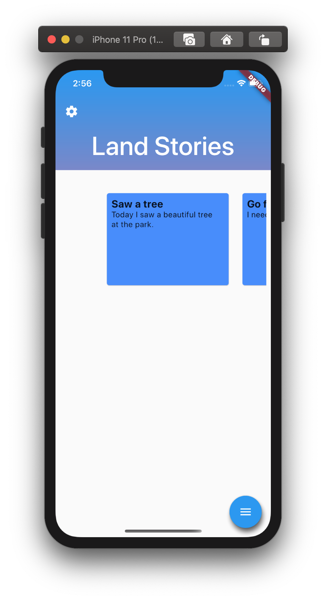
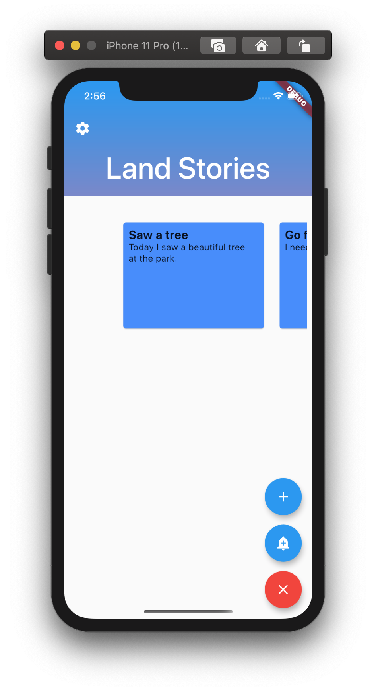
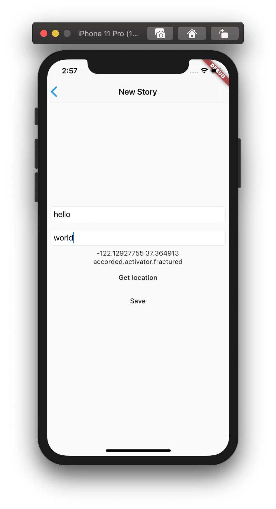
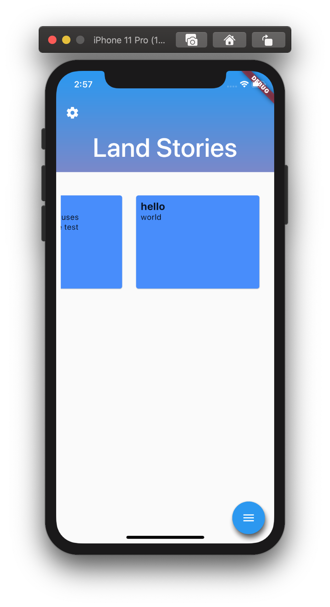
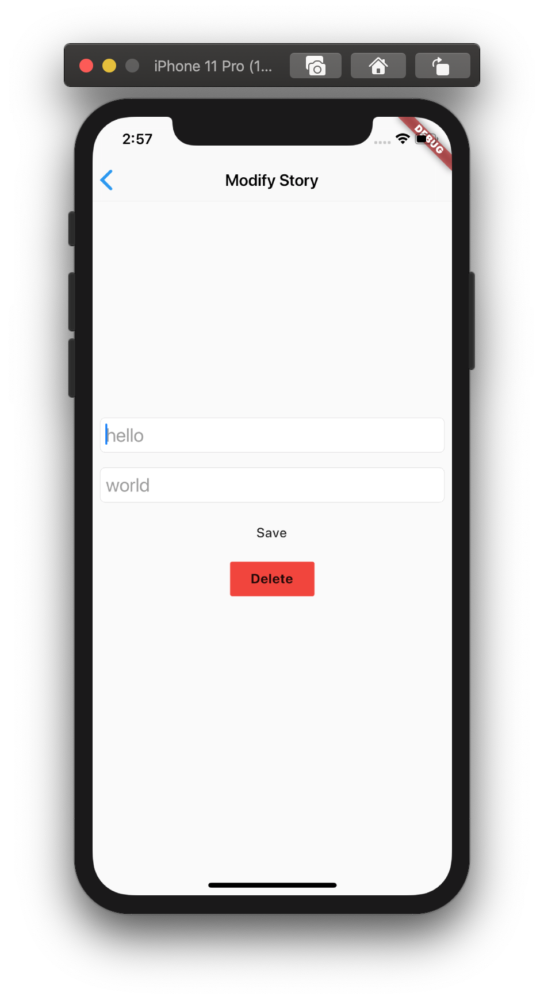
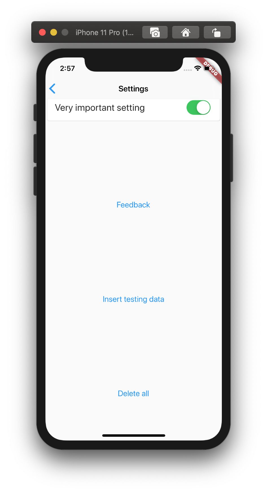

# Land Stories
A mobile app that stores quick snippets of things spotted outside and reminds you of tasks that need to get done. 

This app is designed and built for a school project.

## Features

#### Completed features:
	
* Add, edit and delete stories
	
#### Features in progress:
	
* Reminders
* Capture and save images with stories
* Identify weeds and other species
	
#### Future features
	
* Sharing stories with other users

## Progress update screenshots:

> The `Insert testing data` and `Delete all` buttons are for testing. 
